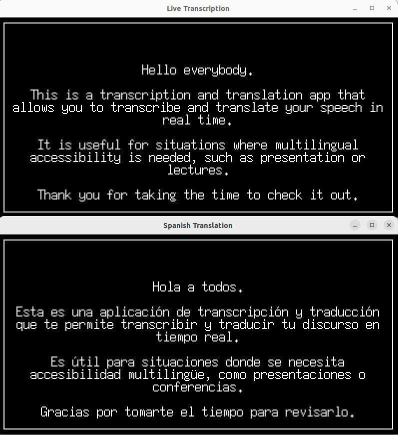

# Live Audio Transcription and Translation

Real-time audio transcription and translation system using Voice Activity Detection (VAD), Runpod API, and OpenAI. Features a tkinter-based GUI displaying live transcriptions and Spanish translations.




## Features

- 🎤 Real-time voice activity detection using `webrtcvad`
- 📝 Live audio transcription via `Runpod` API
- 🌐 Automatic Spanish translation using `OpenAI`
- 💻 User-friendly GUI built with `tkinter`
- 🔊 Background noise reduction through VAD

## Prerequisites

- Python 3.x
- ffmpeg (for audio processing)
- Runpod account with funds
- OpenAI API key

## Installation

1. Clone the repository:
```bash
git clone <repository_url>
cd <repository_folder>
```

2. Install required packages:
```bash
pip install requests sounddevice numpy scipy webrtcvad tkinter python-dotenv openai
```

## API Setup

### Runpod Configuration

1. Create an account at [Runpod.io](https://www.runpod.io/)
2. Add funds to your account
3. Create a serverless endpoint:
   - Select `faster-whisper` model
   - Choose `base` or `small` model size
   - Enable Voice Activity Detection
   - (Optional) Enable Word Timestamps
4. Save your endpoint ID and API key

### Environment Setup

Create a `.env` file in the project root:
```env
RUNPOD_API_KEY=your_runpod_api_key
RUNPOD_ENDPOINT_ID=your_runpod_endpoint_id
OPENAI_API_KEY=your_openai_api_key
```

## Usage

1. Start the application:
```bash
python run.py
```

2. The GUI will display:
   - Main window: Live transcriptions
   - Secondary window: Spanish translations

3. Speak into your microphone:
   - Voice activity is automatically detected
   - Transcription appears in real-time
   - Translations follow shortly after

## Technical Configuration

### Audio Settings
- Sample Rate: 16000 Hz
- Frame Duration: 30ms
- VAD Mode: 1 (minimal noise sensitivity)
- Silence Threshold: 3 seconds

### Performance
- Configurable worker thread count for audio processing
- Optimized for real-time performance

## License

This project is licensed under the MIT License - see the [LICENSE](LICENSE) file for details.

## Acknowledgments

- WebRTC VAD for voice activity detection
- Runpod for efficient transcription services
- OpenAI for translation capabilities
